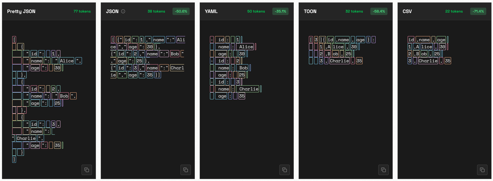

# From JSON to TOON (Token-Oriented Object Notation)

- [From JSON to TOON (Token-Oriented Object Notation)](#from-json-to-toon-token-oriented-object-notation)
  - [Brief of TOON](#brief-of-toon)
  - [When to Use or Not Use TOON?](#when-to-use-or-not-use-toon)
  - [Benchmarks from online playground](#benchmarks-from-online-playground)
  - [Compare between JSON and TOON](#compare-between-json-and-toon)
    - [01 Basic JSON - Simple User Profile](#01-basic-json---simple-user-profile)
    - [02 Basic JSON - E-commerce Product](#02-basic-json---e-commerce-product)
    - [03 Basic JSON - Address Information](#03-basic-json---address-information)
    - [04 JSON Array - List of Users](#04-json-array---list-of-users)
    - [05 JSON Array - Product Catalog](#05-json-array---product-catalog)
    - [06 Nested JSON - User Profile with Nested Address](#06-nested-json---user-profile-with-nested-address)
    - [07 Nested JSON - E-commerce Order with Items](#07-nested-json---e-commerce-order-with-items)
    - [08 Nested JSON - Company with Departments and Employees](#08-nested-json---company-with-departments-and-employees)
    - [09 API Response - REST API Success Response](#09-api-response---rest-api-success-response)
    - [10 API Response - REST API Error Response](#10-api-response---rest-api-error-response)
    - [11 API Response - Paginated API Response](#11-api-response---paginated-api-response)
  - [JSON - TOON Comparison Summary](#json---toon-comparison-summary)
  - [One Statistic Comparison](#one-statistic-comparison)
  - [Installation of TOON](#installation-of-toon)
- [Introduction and Demo Video](#introduction-and-demo-video)

## Brief of TOON

TOON Project in GitHub: https://github.com/toon-format/toon


TOON - Token-Oriented Object Notation - comparing to JSON (JavaScript Object Notation), is the latest introduced, compact, human-readable, schema-aware serialization for LLM prompts.

The purpose of its design is for passing structured data to Large Language Models with significantly reduced token usage.

TOON's sweet spot is **uniform arrays of objects** - multiple fields per row, same structure across items. It borrows YAML(YAML Ain't Markup Lanauage)'s indentation-based structure for nested objects and CSV(Comma-Separated Values)'s tabular formate for uniform data rows, then optimizes both for token efficiency in LLM contexts. While, for deeply nested or non-uniform data, JSON may be more efficient.

Think of TOON as a tranlation layer: use JSON programmatically, convert to TOON for LLM input. --> the goal is the minimize the numbers of tokens while it's still costly in LLM.

## When to Use or Not Use TOON?

For small payloads, JSON/CSV/YAML work fine. TOON's value emerges at scale: when you're making hundreds of LLM calls with uniform tabular data, eliminating repeated keys compounds saving significantly.

If token costs matter to your use case, TOON reduces them. If not, sticke with what works.

When NOT to use TOON: TOON excels with uniform arrays of objects, but there are cases where other formats are better:

- **Deeply nested or non-uniform structures** (tabular eligibility $\approx$ 0%): JSON-compact often uses fewer tokens.
- **Semi-uniform arrays** (~40-60% tabular eligibility): Token saving diminish. Prefer JSON if your pipelines already rely on it.
- **Flat CSV use-cases**: CSV is smaller than TOON for pure tabular data. TOON adds minimal overhead (~5-10%) to provide structure (length markers, field headers, delimiter scoping) that improves LLM reliability.

## Benchmarks from online playground

From interactive Format Tokenization Playground (https://www.curiouslychase.com/playground/format-tokenization-exploration), you can compare token usage across CSV, JSON, YAML, and TOON. For now it's only supporting the sample data.



## Compare between JSON and TOON

This article - using JSON-TOON converter - to show you the tokenization comparison between variable JSON format samples data with TOON.

JSON examples are referred from https://jsontotable.org/blog/json/sample-json

### 01 Basic JSON - Simple User Profile

Basic use information with common field.

Use case: User authentication, profile management, account systems

JSON:

```JSON
{
  "userId": 12345,
  "username": "john_doe",
  "email": "john.doe@example.com",
  "firstName": "John",
  "lastName": "Doe",
  "age": 28,
  "isActive": true,
  "role": "user"
}
```

TOON:

```
userId: 12345
username: john_doe
email: john.doe@example.com
firstName: John
lastName: Doe
age: 28
isActive: true
role: user
```

JSON: ~48 tokens, TOON: ~31 tokens, (35.4% less)

### 02 Basic JSON - E-commerce Product

Product data for online stores and catalogs.

Use cases: E-commerce platforms, inventory management, product catalogs

JSON:

```JSON
{
  "productId": "PROD-2024-001",
  "name": "Wireless Bluetooth Headphones",
  "category": "Electronics",
  "price": 79.99,
  "currency": "USD",
  "inStock": true,
  "quantity": 145,
  "rating": 4.5,
  "brand": "AudioTech"
}
```

TOON:

```
productId: PROD-2024-001
name: Wireless Bluetooth Headphones
category: Electronics
price: 79.99
currency: USD
inStock: true
quantity: 145
rating: 4.5
brand: AudioTech
```

JSON: ~57 tokens, TOON: ~38 tokens, (33.3% less)

### 03 Basic JSON - Address Information

Standard address format for shipping and contact information.

Use case: Shipping systems, contact forms, location services

JSON:

```JSON
{
  "street": "123 Main Street",
  "city": "San Francisco",
  "state": "CA",
  "zipCode": "94102",
  "country": "USA",
  "type": "residential"
}
```

TOON:

```
street: 123 Main Street
city: San Francisco
state: CA
zipCode: "94102"
country: USA
type: residential
```

JSON: ~38 tokens, TOON: ~24 tokens, (36.8% less)

### 04 JSON Array - List of Users

Multiple user records in an array.

Use case: user management systemsm, admin dashboards, team directories.

JSON:

```JSON
{
  "users": [
    {
      "id": 1,
      "name": "Alice Johnson",
      "email": "alice@example.com",
      "role": "admin"
    },
    {
      "id": 2,
      "name": "Bob Smith",
      "email": "bob@example.com",
      "role": "user"
    },
    {
      "id": 3,
      "name": "Charlie Brown",
      "email": "charlie@example.com",
      "role": "moderator"
    }
  ],
  "total": 3
}
```

TOON:

```
users[3]{id,name,email,role}:
  1,Alice Johnson,alice@example.com,admin
  2,Bob Smith,bob@example.com,user
  3,Charlie Brown,charlie@example.com,moderator
total: 3
```

JSON: ~91 tokens, TOON: ~50 tokens, (45.1% less)

### 05 JSON Array - Product Catalog

Collection of products with pricing and availability.

Use case: shopping carts, product lisitings, inventory APIs

JSON:

```JSON
{
  "products": [
    {
      "id": "P001",
      "name": "Laptop",
      "price": 999.99,
      "inStock": true
    },
    {
      "id": "P002",
      "name": "Mouse",
      "price": 29.99,
      "inStock": true
    },
    {
      "id": "P003",
      "name": "Keyboard",
      "price": 79.99,
      "inStock": false
    }
  ]
}
```

TOON:

```
products[3]{id,name,price,inStock}:
  P001,Laptop,999.99,true
  P002,Mouse,29.99,true
  P003,Keyboard,79.99,false
```

JSON: ~74 tokens, TOON: ~38 tokens, (48.6% less)

### 06 Nested JSON - User Profile with Nested Address

User object containing nested address and contact information.

Use case: customer relationship management, account profiles, registration systems

JSON:

```JSON
{
  "userId": 1001,
  "name": "Sarah Williams",
  "email": "sarah.w@example.com",
  "address": {
    "street": "456 Oak Avenue",
    "city": "Portland",
    "state": "OR",
    "zipCode": "97201",
    "country": "USA"
  },
  "phone": {
    "home": "+1-503-555-0123",
    "mobile": "+1-503-555-0124"
  },
  "preferences": {
    "newsletter": true,
    "notifications": false,
    "language": "en"
  }
}
```

TOON:

```
userId: 1001
name: Sarah Williams
email: sarah.w@example.com
address:
  street: 456 Oak Avenue
  city: Portland
  state: OR
  zipCode: "97201"
  country: USA
phone:
  home: +1-503-555-0123
  mobile: +1-503-555-0124
preferences:
  newsletter: true
  notifications: false
  language: en
```

JSON: ~103 tokens, TOON: ~68 tokens, (34.0% less)

### 07 Nested JSON - E-commerce Order with Items

Complete order structure with customers, items, and payment details.

Use case: order management, e-commerce platforms, invoice systems

JSON:

```
{
  "orderId": "ORD-2025-12345",
  "orderDate": "2025-01-15T10:30:00Z",
  "customer": {
    "customerId": 5678,
    "name": "Michael Chen",
    "email": "michael.chen@example.com"
  },
  "items": [
    {
      "productId": "PROD-001",
      "name": "Wireless Mouse",
      "quantity": 2,
      "price": 29.99
    },
    {
      "productId": "PROD-002",
      "name": "USB Cable",
      "quantity": 3,
      "price": 9.99
    }
  ],
  "shipping": {
    "method": "Express",
    "cost": 15.00,
    "address": {
      "street": "789 Pine Street",
      "city": "Seattle",
      "state": "WA",
      "zipCode": "98101"
    }
  },
  "payment": {
    "method": "credit_card",
    "last4": "4242",
    "status": "paid"
  },
  "subtotal": 89.95,
  "tax": 8.10,
  "total": 113.05,
  "status": "processing"
}
```

TOON:

```
orderId: ORD-2025-12345
orderDate: "2025-01-15T10:30:00Z"
customer:
  customerId: 5678
  name: Michael Chen
  email: michael.chen@example.com
items[2]{productId,name,quantity,price}:
  PROD-001,Wireless Mouse,2,29.99
  PROD-002,USB Cable,3,9.99
shipping:
  method: Express
  cost: 15
  address:
    street: 789 Pine Street
    city: Seattle
    state: WA
    zipCode: "98101"
payment:
  method: credit_card
  last4: "4242"
  status: paid
subtotal: 89.95
tax: 8.1
total: 113.05
status: processing
```

JSON: ~196 tokens, TOON: ~127 tokens, (35.2% less)

### 08 Nested JSON - Company with Departments and Employees

Organizational hierarchy with nested depertments and staff.

Use cases: HR systems, organizational charts, employee management

JSON:

```JSON
{
  "companyId": "COMP-2025",
  "name": "TechCorp Inc.",
  "founded": 2010,
  "headquarters": {
    "city": "San Francisco",
    "state": "CA",
    "country": "USA"
  },
  "departments": [
    {
      "departmentId": "DEPT-001",
      "name": "Engineering",
      "manager": "Jane Smith",
      "employees": [
        {
          "employeeId": "EMP-101",
          "name": "David Lee",
          "position": "Senior Developer",
          "salary": 120000
        },
        {
          "employeeId": "EMP-102",
          "name": "Emma Wilson",
          "position": "DevOps Engineer",
          "salary": 110000
        }
      ]
    },
    {
      "departmentId": "DEPT-002",
      "name": "Marketing",
      "manager": "Robert Johnson",
      "employees": [
        {
          "employeeId": "EMP-201",
          "name": "Lisa Anderson",
          "position": "Marketing Manager",
          "salary": 95000
        }
      ]
    }
  ],
  "totalEmployees": 3
}
```

TOON:

```
companyId: COMP-2025
name: TechCorp Inc.
founded: 2010
headquarters:
  city: San Francisco
  state: CA
  country: USA
departments[2]:
  - departmentId: DEPT-001
    name: Engineering
    manager: Jane Smith
    employees[2]{employeeId,name,position,salary}:
      EMP-101,David Lee,Senior Developer,120000
      EMP-102,Emma Wilson,DevOps Engineer,110000
  - departmentId: DEPT-002
    name: Marketing
    manager: Robert Johnson
    employees[1]{employeeId,name,position,salary}:
      EMP-201,Lisa Anderson,Marketing Manager,95000
totalEmployees: 3
```

JSON: ~180 tokens, TOON: ~116 tokens, (35.6% less)

### 09 API Response - REST API Success Response

Standard API response with status, message, and data payload.

Use cases: REST API responses, success message, data retrieval endpoints.

JSON:

```JSON
{
  "status": "success",
  "statusCode": 200,
  "message": "Data retrieved successfully",
  "data": {
    "userId": 12345,
    "username": "john_developer",
    "email": "john@example.com",
    "createdAt": "2024-01-15T08:30:00Z"
  },
  "meta": {
    "timestamp": "2025-01-15T12:00:00Z",
    "requestId": "req-abc123",
    "version": "v1"
  }
}
```

TOON:

```
status: success
statusCode: 200
message: Data retrieved successfully
data:
  userId: 12345
  username: john_developer
  email: john@example.com
  createdAt: "2024-01-15T08:30:00Z"
meta:
  timestamp: "2025-01-15T12:00:00Z"
  requestId: req-abc123
  version: v1
```

JSON: ~85 tokens, TOON: ~59 tokens, (30.6% less)

### 10 API Response - REST API Error Response

Error response with details for debugging and error handling.

Use cases: Error handling, API validation, debugging systems.

JSON:

```JSON
{
  "status": "error",
  "statusCode": 404,
  "message": "Resource not found",
  "error": {
    "code": "RESOURCE_NOT_FOUND",
    "details": "User with ID 99999 does not exist",
    "field": "userId"
  },
  "meta": {
    "timestamp": "2025-01-15T12:00:00Z",
    "requestId": "req-xyz789"
  }
}
```

TOON:

```
status: error
statusCode: 404
message: Resource not found
error:
  code: RESOURCE_NOT_FOUND
  details: User with ID 99999 does not exist
  field: userId
meta:
  timestamp: "2025-01-15T12:00:00Z"
  requestId: req-xyz789
```

JSON: ~72 tokens, TOON: ~49 tokens, (31.9% less)

### 11 API Response - Paginated API Response

List response with pagination metadata for large datasets.

Use cases: list endpoints, data tables, infinite scroll implementations

JSON:

```JSON
{
  "status": "success",
  "data": [
    {
      "id": 1,
      "title": "First Blog Post",
      "author": "Alice"
    },
    {
      "id": 2,
      "title": "Second Blog Post",
      "author": "Bob"
    }
  ],
  "pagination": {
    "currentPage": 1,
    "totalPages": 10,
    "pageSize": 2,
    "totalItems": 20,
    "hasNextPage": true,
    "hasPreviousPage": false
  },
  "links": {
    "self": "/api/posts?page=1",
    "next": "/api/posts?page=2",
    "last": "/api/posts?page=10"
  }
}
```

TOON:

```
status: success
data[2]{id,title,author}:
  1,First Blog Post,Alice
  2,Second Blog Post,Bob
pagination:
  currentPage: 1
  totalPages: 10
  pageSize: 2
  totalItems: 20
  hasNextPage: true
  hasPreviousPage: false
links:
  self: /api/posts?page=1
  next: /api/posts?page=2
  last: /api/posts?page=10
```

JSON: ~119 tokens, TOON: ~78 tokens, (34.5% less)

## JSON - TOON Comparison Summary

| Category | Use Case | JSON Tokens | TOON Tokens | % less | Saving Illustration |
| --- | --- | --- | --- | --- | --- |
| 1. Basic JSON | 1.1 Simple User Profile | ~48 | ~31 | 35.4% |  |
| 1. Basic JSON | 1.2 E-commerce Product | ~57 | ~38 | 33.3% |  |
| 1. Basic JSON | 1.3 Address Information | ~38 | ~24 | 36.8% |  |
| 2. JSON Array | 2.1 List of Users | ~91 | ~50 | 45.1% |  |
| 2. JSON Array | 2.2 Product Catalog | ~74 | ~38 | 48.6% |  |
| 3. Nested JSON | 3.1 User Profile with Nested Address | ~103 | ~68 | 34.0% |  |
| 3. Nested JSON | 3.2 E-commerce Order with Items | ~196 | ~127 | 35.2% |  |
| 3. Nested JSON | 3.3 Company with Departments and Empoloyees | ~180 | ~116 | 35.6% |  |
| 4. API Response | 4.1 REST API Success Response | ~85 | ~59 | 30.6% |  |
| 4. API Response | 4.2 REST API Error Response | ~72 | ~49 | 31.9% |  |
| 4. API Response | 4.3 Paginated API Response | ~119 | ~78 | 34.5% |  |

## One Statistic Comparison

```JSON
{
  "products": [
    {
      "id": "P003",
      "name": "Keyboard",
      "price": 79.99,
      "inStock": false,
      "country": "China"
    }
  ]
}
```

Convert to TOON:

```
products[1]{id,name,price,inStock,country}:
  P003,Keyboard,79.99,false,China
```

Token numbers: in JSON - 34, in TOON - 24.

Increase about 30 tokens in JSON when adding one more product, while about 10 tokens in TOON.

The source file: [JSON-TOON_Comparison.xlsx](./JSON-TOON_Comparison.xlsx)


## Installation of TOON

```
# npm
npm install @toon-format/toon

# pnpm
pnpm add @toon-format/toon

# yarn
yarn add @toon-format/toon
```

Usage example:

```javascript
import { encode } from '@toon-format/toon'

const data = {
    users: [
        { id: 1, name: 'Alice', role: 'admin'},
        { id: 2, name: 'Bob', rolw: 'user' }
    ]
}

console.log(encode(data))
// users[2]{id,name,role}:
//   1,Alice,admin
//   2,Bob,user
```

Create one Node.js app with above javascript file for testing, as below:

```
mkdir my-node-app

cd .\my-node-app\

npm init -y

npm add @toon-format/toon

# create index.js with above code

node index.js

# If you get error:
# SyntaxError: Cannot use import statement outside a module
# change setting in your package.json with "type": "module"
```

# Introduction and Demo Video

- Youtube (Chinese): https://youtu.be/4q6DooWY6Hs
- Youtube (English): https://youtu.be/UK0XDGOINVg
- 抖音（中文）：[深入解析 大语言模型中使用TOON](https://www.douyin.com/jingxuan/search/%E6%B7%B1%E5%85%A5%E8%A7%A3%E6%9E%90%20%E5%A4%A7%E8%AF%AD%E8%A8%80%E6%A8%A1%E5%9E%8B%E4%B8%AD%E4%BD%BF%E7%94%A8TOON?aid=eb324e1e-b25a-4c64-87d7-ebaf4cc051f1&modal_id=7571227573489831210&type=general)
- B站（中文）：[深入解析 TOON (面向分词的对象表示法) Token-Oriented Object Notation](https://www.bilibili.com/video/BV1sPkBBpEpH/?spm_id_from=333.337.search-card.all.click)

---

Enjoy! Updated at 11/10/2025, 2:13:50 PM 