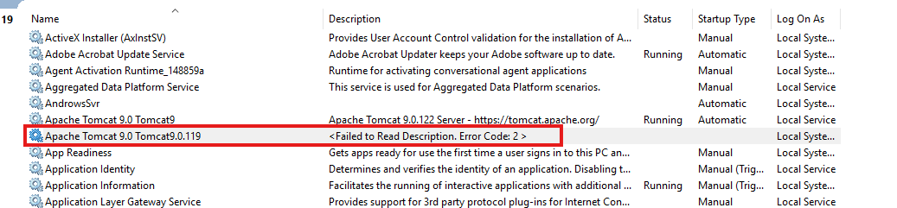
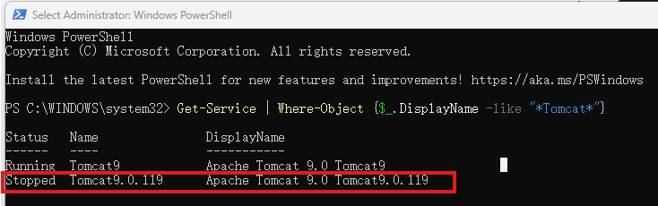
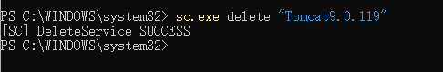

# Delete Unwanted or LeftOver Service From `Windows Service`

## Problem



As shown above, there's one "duplicated" service called `Apache Tomcat 9.0 Tomcat9.0.119`, which had been created for testing purpose, and now it's not the active TomCat service, we need to delete it.

Within `Windows Service` window, there's no such option.

## Open PowerShell

Open PowerShell as administrator and run following command to check if the target process is existed:

```PowerShell
Get-Service | Where-Object {$_.DisplayName -like "*Tomcat*"}
```



## Delete Using Exact Service Name

Still in PowerShell, run command:

```PowerShell
sc.exe delete "Tomcat9.0.119"
```



## Check from Windows Service

Confirm the target service is not in the list anymore.

---

Last updated at 2026-09-17