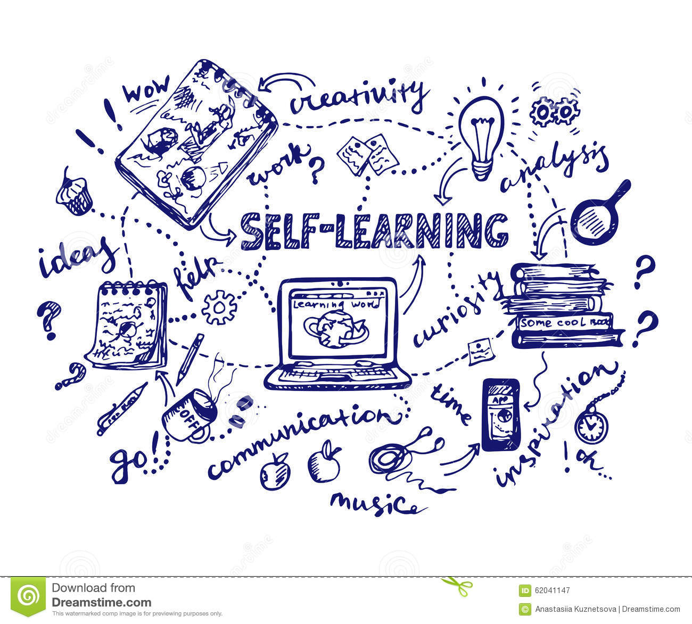

This is the placeholder for Yasen tracking variable self-learning areas before creating into specific repos.

Good quote from [Adam Grant](https://www.linkedin.com/in/adammgrant/), who is author of [THINK AGAIN](https://github.com/yasenstar/books/blob/main/Think_Again.md), on LEARN and UNLEARN!

| LEARN                                                        | UNLEARN                                                      |
| ------------------------------------------------------------ | ------------------------------------------------------------ |
| It takes curiosity to learn.                                 | It takes courage to unlearn.                                 |
| Learning requires the humility to admit what you don't know today. | Unlearning requires the integrity to admit that you were wrong yesterday. |
| Learning is how you evolve.                                  | Unlearning is how you keep up as the world evolves.          |

