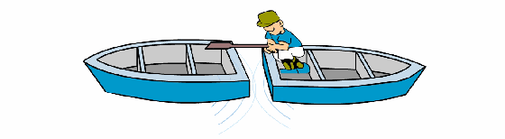
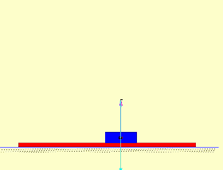
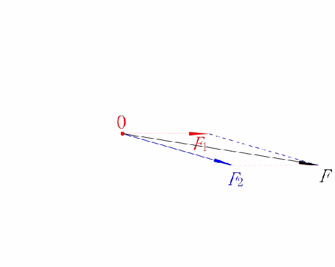
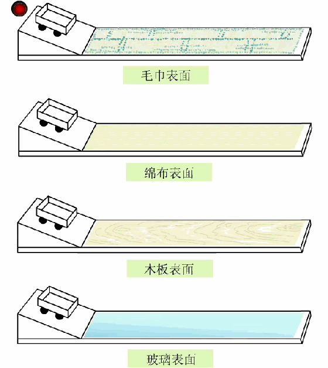
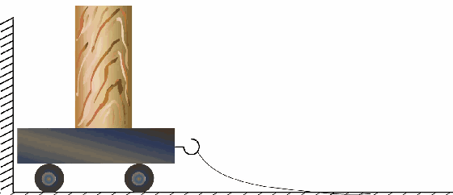
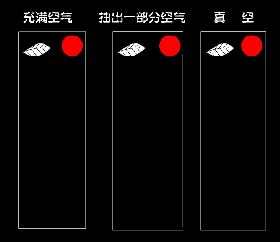
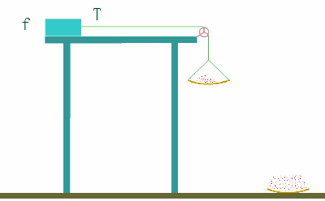

# 50张动图看懂高中物理

## 相互作用

### 作用力与反作用力的特点是什么？

### 摩擦力的大小跟什么有关系？

### 图中两个弹簧的弹力大小是否一样？若一样，为什么？

### 自行车前后轮所受力的方向是什么？

### 物块所受支持力和摩擦力的大小是如何变化的？

### 两个力合力的大小范围是什么？

如果水平面光滑且无穷长小车将做何种运动？

## 动力学

### 突然拉动小车，小车上的物块为什么向后倾倒，突然停止，为什么物块又向前倾倒？

### 通过三幅动图我们能得出什么结论？

### 随着托盘中沙子质量增加，物块的加速度如何变化？

