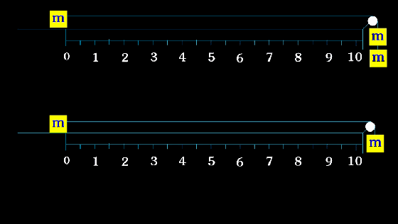
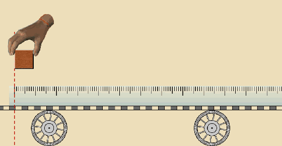
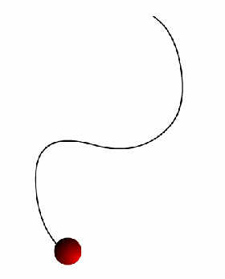
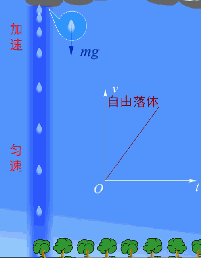
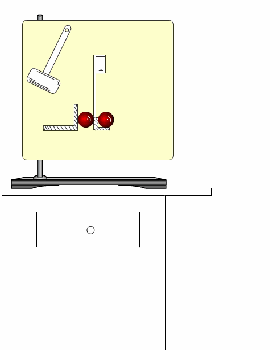

# 50张动图看懂高中物理

## 相互作用

### 作用力与反作用力的特点是什么？

### 摩擦力的大小跟什么有关系？

### 图中两个弹簧的弹力大小是否一样？若一样，为什么？

### 自行车前后轮所受力的方向是什么？

### 物块所受支持力和摩擦力的大小是如何变化的？

### 两个力合力的大小范围是什么？

如果水平面光滑且无穷长小车将做何种运动？

## 动力学

### 突然拉动小车，小车上的物块为什么向后倾倒，突然停止，为什么物块又向前倾倒？

### 通过三幅动图我们能得出什么结论？

### 随着托盘中沙子质量增加，物块的加速度如何变化？

### 上下两幅图的加速度之比是多少？

### 还记得传送带模型是什么吗？记得二级结论吗？

### 连续相等时间内的位移都相等的直线运动是匀速直线运动，这种说法对么?

### 位移和路程的关系是什么？

### 雨滴下落的实际情况是这样的

### 从下图我们能得出什么结论？

### 仔细观察动图，空中的物体和落地的物体有什么特点？

### 枪口正对着猴子还是猴子的下方，上方？

