# Ticketing for Forbidden City

- [Ticketing for Forbidden City](#ticketing-for-forbidden-city)
  - [Note](#note)
  - [Booking Steps](#booking-steps)
    - [1. Open the Home Page](#1-open-the-home-page)
    - [2. Read the `Booking Instructions`](#2-read-the-booking-instructions)
      - [Ticketing Information](#ticketing-information)
      - [Policies on Admission Discounts and Free and Reduced Admission](#policies-on-admission-discounts-and-free-and-reduced-admission)
      - [Policies on Admission Discounts and Free and Reduced Admission to the Gallery of Clocks and the Treasure Gallery](#policies-on-admission-discounts-and-free-and-reduced-admission-to-the-gallery-of-clocks-and-the-treasure-gallery)
    - [3. Select the Visit Date and Quentity](#3-select-the-visit-date-and-quentity)
    - [4. Sign in Account](#4-sign-in-account)
    - [5. Enter Visitor Information](#5-enter-visitor-information)
    - [6. Select an exhibition](#6-select-an-exhibition)
    - [7. Confirm the order](#7-confirm-the-order)

URL in English: https://intl.dpm.org.cn/index.html?l=en

## Note

Must reserve ticket either from web online or via WeChat mini-program.

## Booking Steps

### 1. Open the Home Page

From the top-right, choose language `EN`, then click `Tickets` button

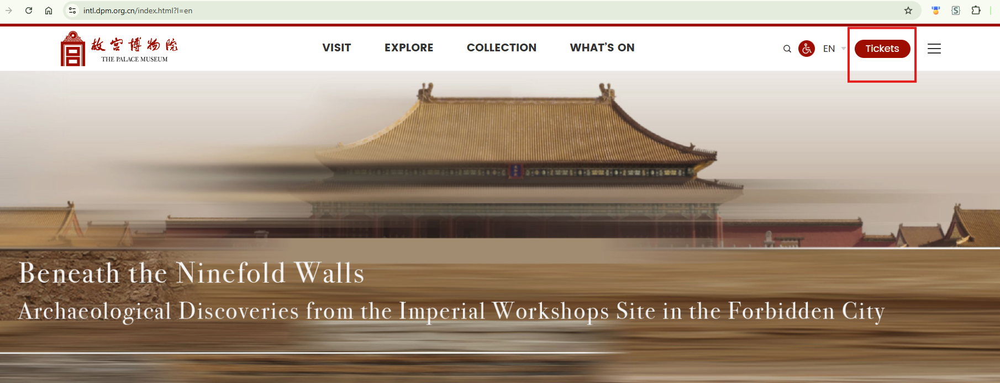

### 2. Read the `Booking Instructions`

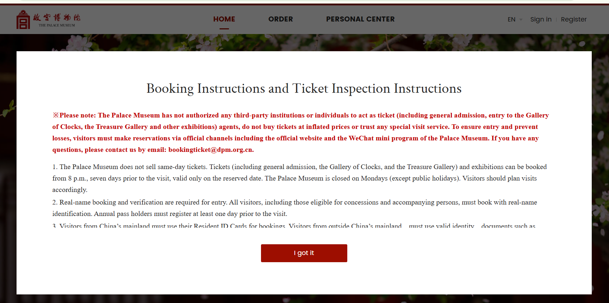

> **※Please note**: The Palace Museum has not authorized any third-party institutions or individuals to act as ticket (including general admission, entry to the Gallery of Clocks, the Treasure Gallery and other exhibitions) agents, do not buy tickets at inflated prices or trust any special visit service. To ensure entry and prevent losses, visitors must make reservations via official channels including the official website and the WeChat mini program of the Palace Museum. If you have any questions, please contact us by email: bookingticket@dpm.org.cn.

1. The Palace Museum **does not sell same-day tickets**. Tickets (including general admission, the Gallery of Clocks, and the Treasure Gallery) and exhibitions can be **booked from 8 p.m., seven days prior to the visit**, valid only on the reserved date. The Palace Museum is **closed on Mondays** (except public holidays). Visitors should plan visits accordingly.

2. Real-name booking and verification are required for entry. All visitors, including those eligible for concessions and accompanying persons, must book with real-name identification. Annual pass holders must register at least one day prior to the visit.

3. Visitors from China’s mainland must use their Resident ID Cards for bookings. **Visitors from outside China’s mainland** must use valid identity documents such as Mainland Travel Permits for Hong Kong and Macao Residents, Mainland Travel Permits for Taiwan Residents, Residence Permits for Hong Kong, Macao, and Taiwan Residents, **Foreign Permanent Resident ID Cards, or passports**. Each document allows only one ticket per visit day. The ticket is valid only for the registered ID holder. Once the ticket is issued, no modifications to ticket type, visit date/time slot, or visitor information are permitted.

4. **The Meridian Gate (Wu men) is the only entrance for visitors to the Palace Museum**. Visitors must present their original valid ID used for booking upon entry. Please double-check your booking details beforehand. Exit after the visit is via the Gate of Divine Prowess (Shenwu men) or East Prosperity Gate (Donghua men).

5. **Daily bookings are divided into morning and afternoon sessions**. Morning visitors must check in by 12 noon; afternoon visitors may begin check-in no earlier than 11 a.m. Please arrive at the scheduled time to avoid denied entry and disruption to your visit.

6. Visitors only holding Palace Museum tickets cannot access the Meridian Gate from Tian’anmen Square and must enter from the East or West Tongzi River Road. Those with reservations for both Tian’anmen Square and the Palace Museum can reach the Meridian Gate through security checkpoints in Tian’anmen Square. However, please note that the pedestrian walkway connecting Tian’anmen Square and the Palace Museum is one-way only, heading northbound.

7. Tickets are non-refundable once used. Unused tickets (including general admission, the Gallery of Clocks, and the Treasure Gallery) can be refunded via the original booking channel before 12 midnight, one day prior to the visit, to avoid being considered a no-show. Tickets can be refunded before 8 p.m. on the visit day, counting as one no-show. No refunds are available after 8 p.m. on the visit day.

8. Certain exhibitions require advance bookings and please see the booking page for details. Cancellations must be made before 12 midnight, one day prior to the visit, to avoid being considered a no-show. Failure to cancel on time as requested counts as one no-show.

9. Each person is allowed only one no-show per day. Three no-shows within 180 days result in a 60-day suspension from booking tickets and exhibitions from the day following the third no-show.

10. Refunds will be made via the original payment method for ticket booking within five working days from cancellation. Please contact our customer service if refunds are not received.

11. For invoices, please contact our customer service within one month of booking, or present your original valid ID used for booking at the ticket service window of the Visitor Service Center.

12. The Palace Museum bears no responsibility for disruptions to visits caused by temporary closures or restricted access to certain areas due to force majeure.

13. Opening Hours for Ticket Service Windows at the Visitor Service Center, Gallery of Clocks, and Treasure Gallery:
    - Peak Season ( April 1 – October 31): 8:30 a.m.-4 p.m.
    - Low Season (November 1 – March 31): 8:30 a.m.-3:30 p.m.

14. Customer Service: 400-950-1925 (Available Hours: 8:00 a.m.-8 p.m. (year-round))

#### Ticketing Information

1. Admission: April 1 - October 31 (peak season), 60 yuan / person

2. Admission: November 1 - March 31 (low season), 40 yuan / person

3. The Treasure Gallery: 10 yuan / person

4. The Gallery of Clocks: 10 yuan / person

#### Policies on Admission Discounts and Free and Reduced Admission

1. Students between 7 and 18, as well as undergraduate students (not including adult, continuing-education, or graduate students), may purchase student tickets for 20 yuan per person during peak and low seasons with the use of a student ID card or letter of introduction from the school.

2. Visitors aged 60 and older may purchase half-price tickets with the use of their ID cards.

3. Children aged 6 and under may enjoy free admission.

4. People with disabilities or impairments with an ID card indicating disability or impairment may enjoy free admission.

5. On International Women’s Day (March 8), women may purchase half-price tickets.

6. On International Children's Day (June 1), one accompanying parent of children under 14 years old is eligible for half-price admission.

#### Policies on Admission Discounts and Free and Reduced Admission to the Gallery of Clocks and the Treasure Gallery

1. Students between 7 and 18, as well as undergraduate students (not including adult, continuing-education, or graduate students), may purchase student tickets for 5 yuan per person during peak and low seasons with the use of a student ID card or letter of introduction from the school.

2. Visitors aged 60 and older may purchase half-price tickets for 5 yuan per person with the use of their ID cards.

3. Children aged 6 and under may enjoy free admission.

4. People with disabilities or impairments with an ID card indicating disability or impairment may enjoy free admission.

5. On International Women’s Day (March 8), women may purchase half-price tickets for 5 yuan per person.

6. On International Children's Day (June 1), one accompanying parent of children under 14 years old is eligible for half-price admission.

Click `I Got It` and then "Book tickets" button (or scroll down)

### 3. Select the Visit Date and Quentity

Current date for this guide is: May 4th, 2026

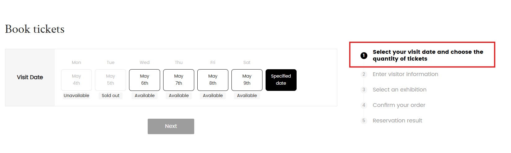

Only next maximum 7 days can be seen, click one of the Available Date, the "Visiting time" will be shown:

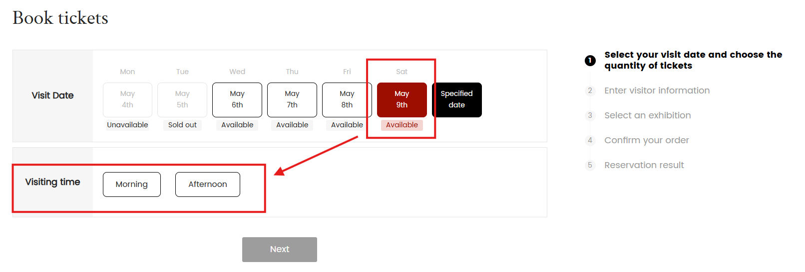

You may decide which half-day for the visiting.

Hover on any available date, some more hints will be shown:

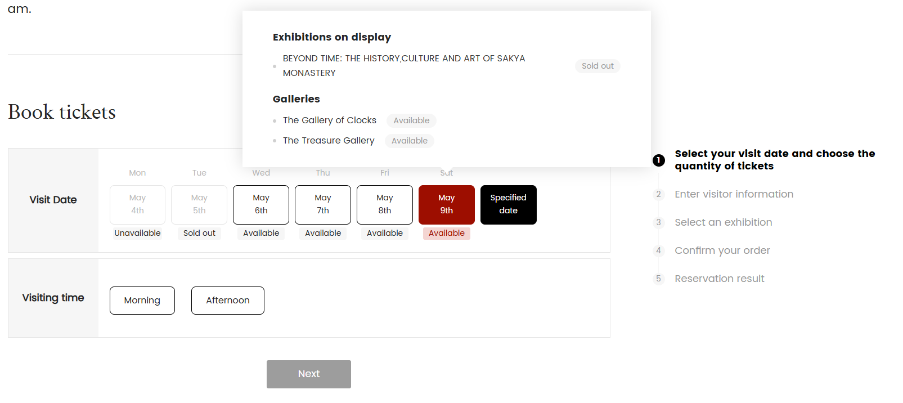

For example, choose "May 9th" and "Morning", then click `Next`, more choices on quantity of tickets are shown as below:

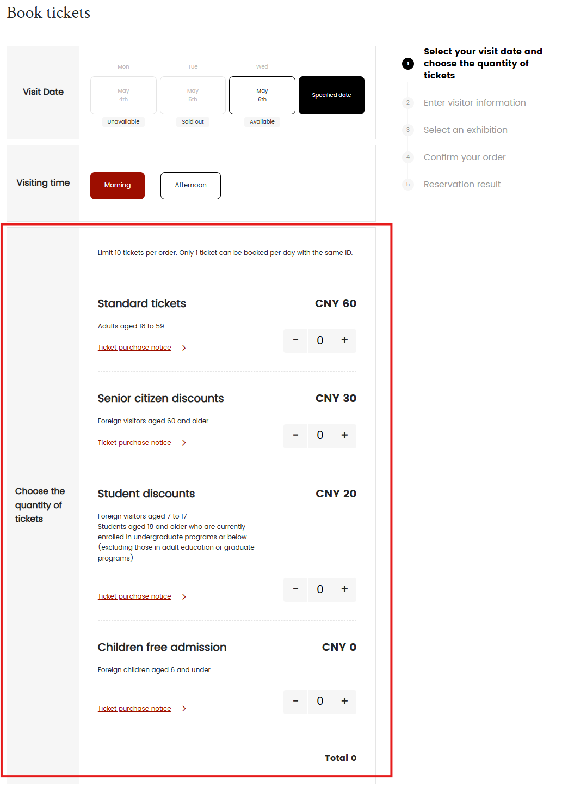

For `Standard tickets`, here is the `Ticket purchase notice`:

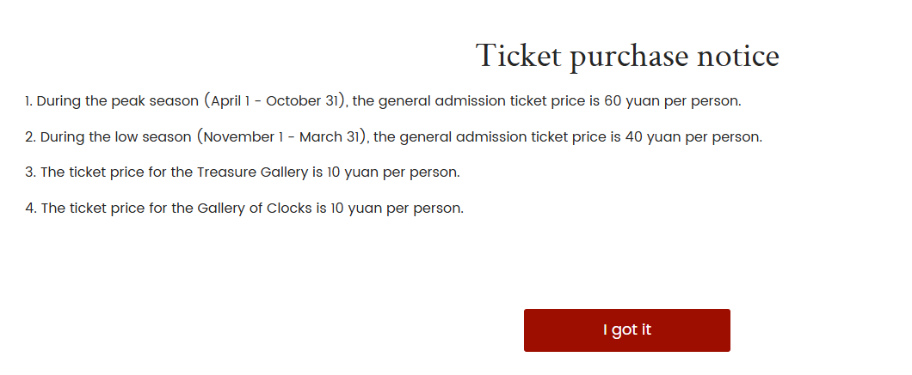

Enter `5` in the `Standard tickets` field as below, then click `Next`:

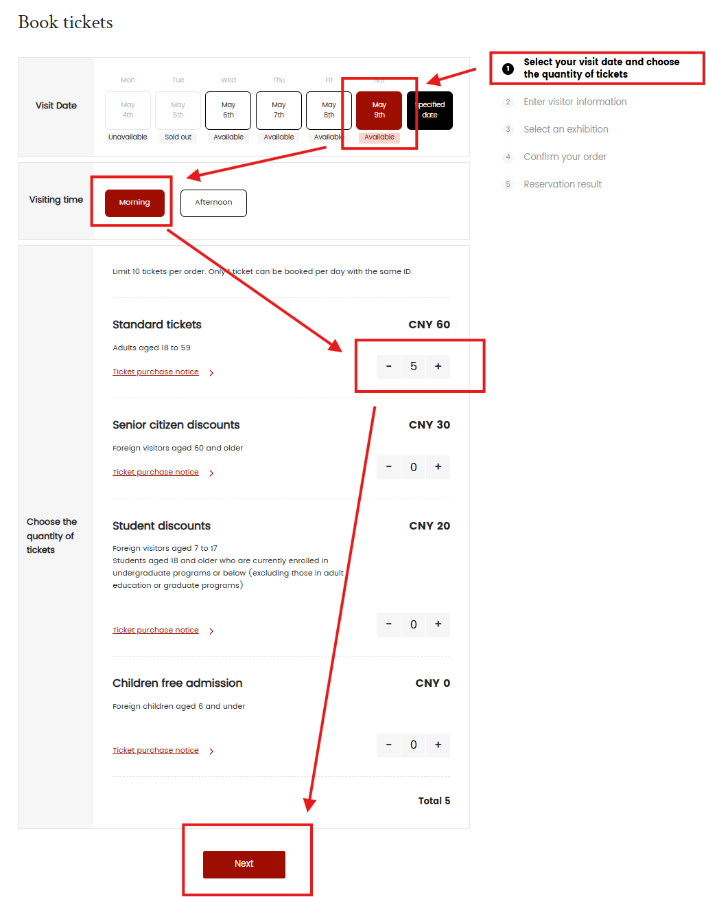

### 4. Sign in Account

You need one valid email address to sign in for performing following steps, below is the pop-up Sign In dialog after previous `Next` clicking:

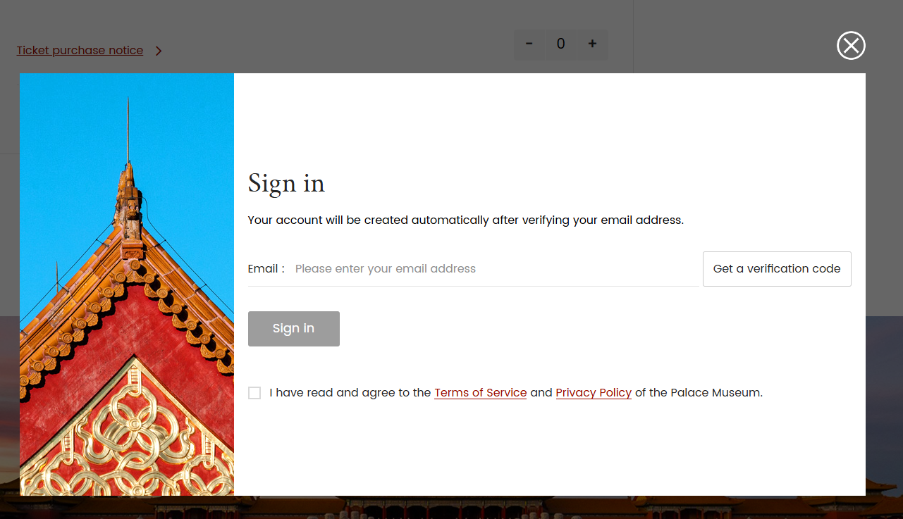

Once entered one email address, two more fields are displayed for multi-factor verification:

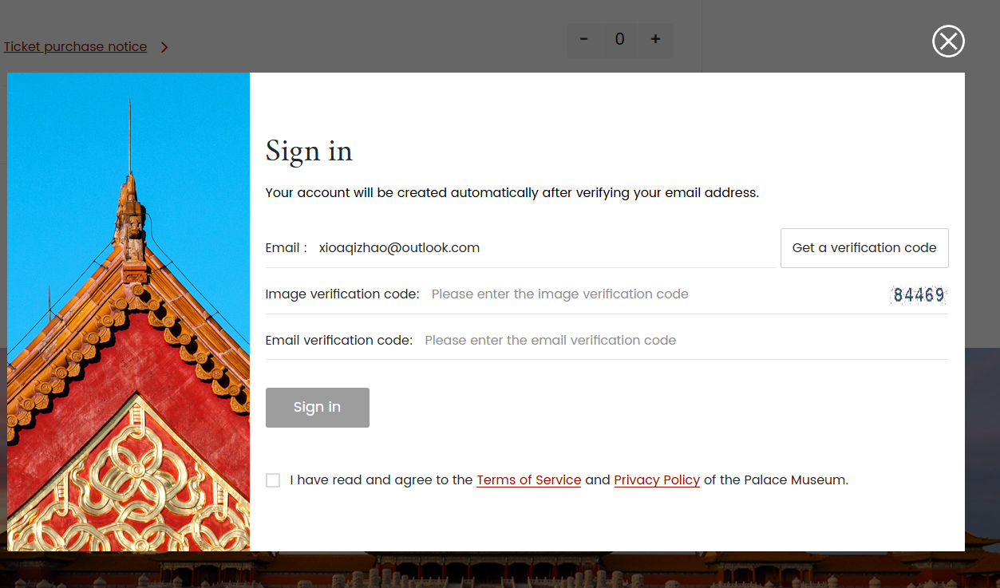

Click `Get a verifictaion code`.

Key in `Image verification code` and the `Email verification code`:

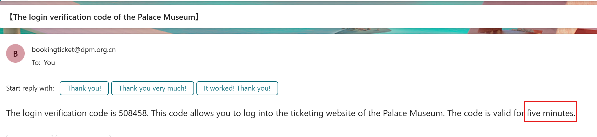

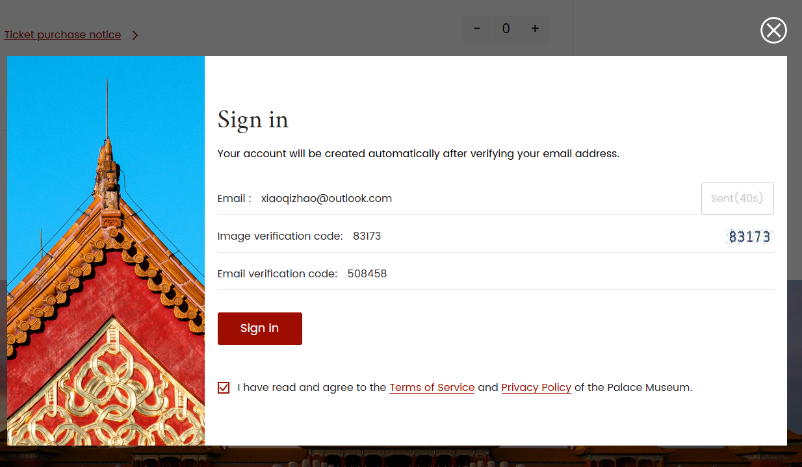

Click `Sign in`

### 5. Enter Visitor Information

Upper part can read the opening and closing time, notice Monday is not open normally:

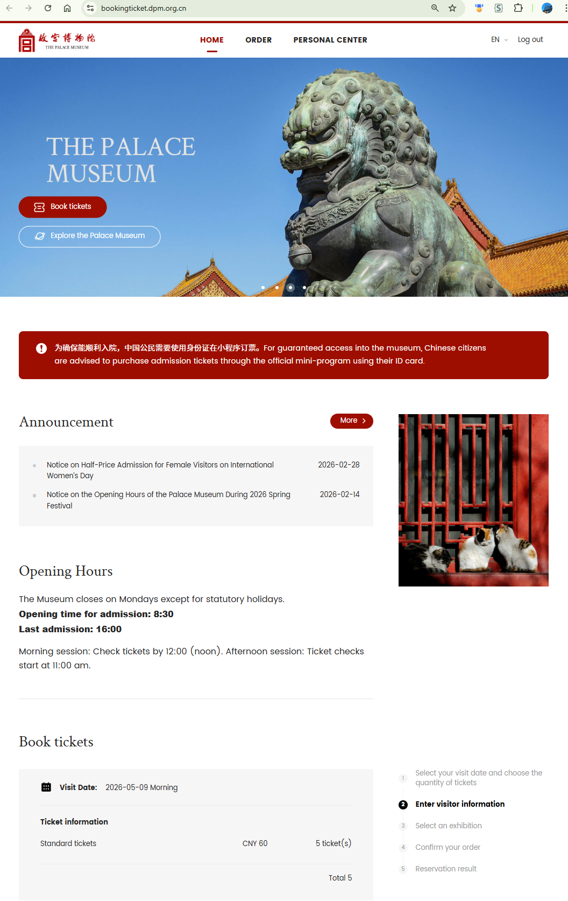

Lower part are the input area for visitory information:

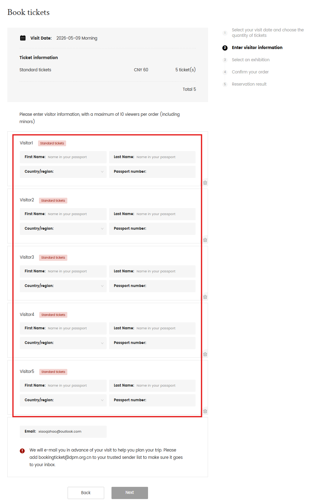

For demo purpose, only keep one visitor and key in dummy information as below, then click `Next`:

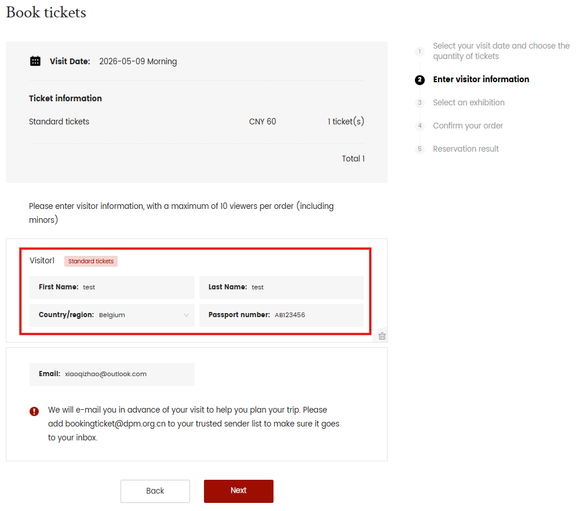

### 6. Select an exhibition

The CNY 60 is the Standard tickets, as below, in this step, additional exhibition pass can be chosen:

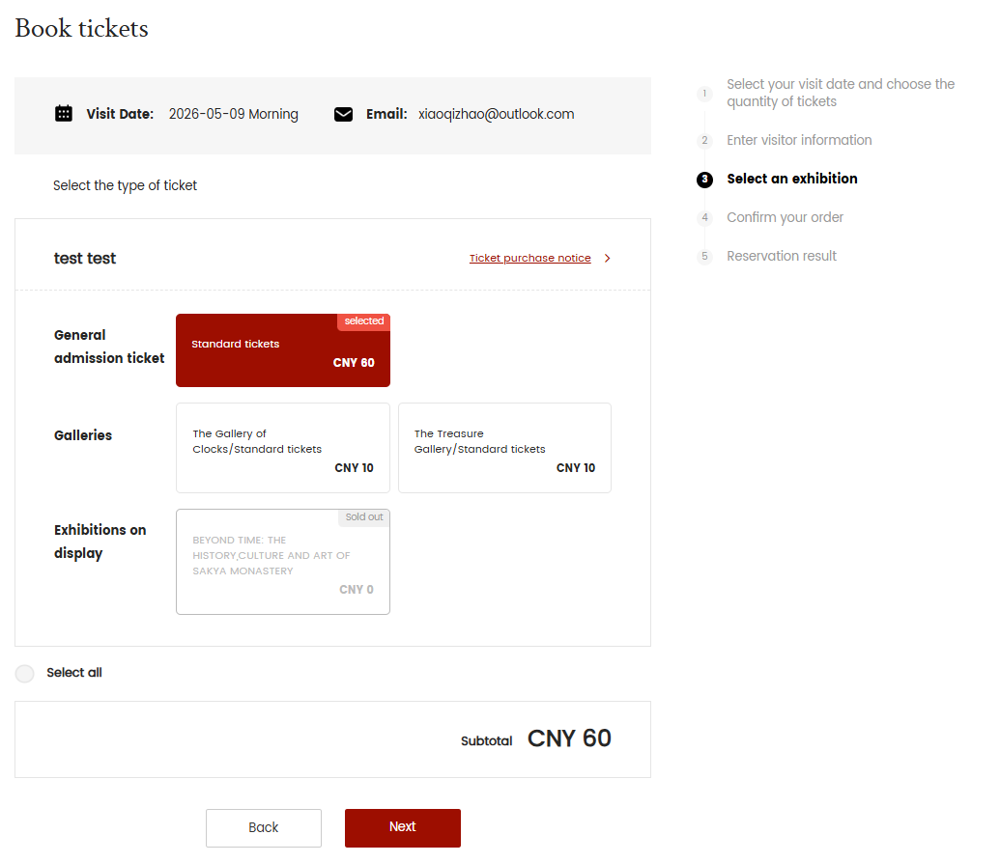

- General adminission ticket: Standard tickets (CNY 60)
- Galleries
  - The Gallery of Clocks/Stnadard tickets (CNY 10)
  - The Treasure Gallery/Stnadard tickets (CNY 10)
- Exhibitions on display: Beyond Time (CNY ? since it's sold out)

After selecting needed exhibition, click `Next`

### 7. Confirm the order

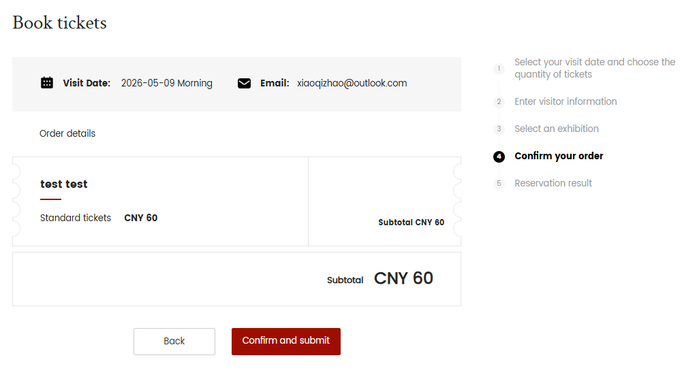

Till now, the ticket(s) should be successfully booked, click `Confirm and submit` will lead to the result screen finally.

---

Document date: 5/4/2026, 7:20:41 PM 