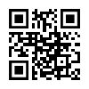
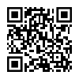
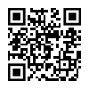
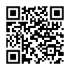
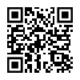

# Sites in China Touring

| Site | URL | QR-Code |
| --- | --- | :---: |
| 雍和宫 Lama Temple | https://www.yonghegong.cn/ (CN) |  |
| 天坛公园 Temple Of Heaven | https://www.tiantanpark.cn/en/index.html (EN) |  |
| 八达岭长城 BaDaLing Great Wall | https://www.badaling.cn/website/pc/index.html#/home (CN/EN) |  |
| 故宫博物院 The Palace Museum | https://intl.dpm.org.cn/index.html?l=en (EN) |  |
| 秦始皇陵兵马俑 Terra Cotta Warriors | https://bmy.com.cn/index.html (EN) |  |

---

QR-Code Generator: https://www.qr-code-generator.com/qr-code-generator-reputation/